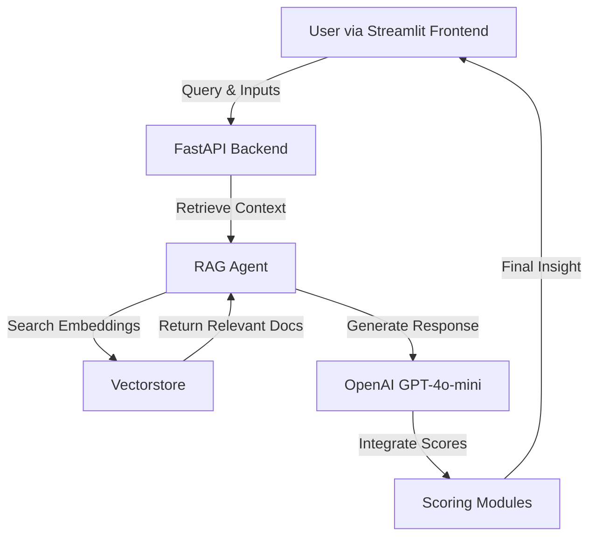

# Future Viability Index (FVI) – RAG-Enhanced Coal Industry Assessment

> **Version:** FVI_V2 – with Retrieval-Augmented Generation (RAG) Agent, OpenAI GPT-4o-mini integration, and updated project structure.

---

## 📑 Table of Contents
1. [Project Overview](#project-overview)
2. [Features](#features)
3. [Architecture](#architecture)
4. [Directory Structure](#directory-structure)
5. [Installation & Setup](#installation--setup)
6. [Usage](#usage)
7. [Development Notes](#development-notes)
8. [Acknowledgement](#acknowledgement)
9. [License](#license)
10. [Authors](#authors)

---

## 📌 Project Overview
The **Future Viability Index (FVI)** is a decision-support framework designed to assess the sustainability, resilience, and long-term viability of coal-dependent economies.

This tool combines:
- **Data ingestion & scoring models** across economic, ecological, infrastructure, and social dimensions.
- **Retrieval-Augmented Generation (RAG)** with **OpenAI GPT-4o-mini** to provide contextual, knowledge-backed insights.
- **Interactive UI** for investors, policymakers, and researchers.

The primary goal is to **evaluate coal industry viability** while supporting strategic decision-making towards a sustainable energy transition.

---

## ✨ Features
- **Modular Scoring** – Dedicated Python modules for each sustainability dimension.
- **RAG Agent** – Retrieves relevant knowledge from `fvi_knowledge.txt` in `vectorstore/` before responding.
- **Semantic Search** – Powered by ChromaDB or FAISS for efficient contextual retrieval.
- **Streamlit Frontend** – User-friendly interactive dashboard.
- **FastAPI Backend** – Handles chat queries, scoring, and data processing.
- **Configurable Knowledge Base** – Easy updates to domain-specific content.
- **Persona-Based Insights** – Responses tailored for investors, policymakers, and researchers.

---

## 🏗 Architecture

### Mermaid Diagram


---

## 📂 Directory Structure
```
FVI/
│── backend/                 # FastAPI backend & RAG agent
│── docs/                    # Documentation and diagrams
│── frontend/                # Streamlit UI, scoring modules & assets
│   │── assets/              # Static assets (logo, images)
│   │── data/                # Raw and processed datasets
│   │── scores/              # Modular scoring scripts
│── scripts/                 # Helper scripts (vectorstore building, utilities)
│── vectorstore/             # Knowledge embeddings & index
│── .env.template            # Environment variable template
│── config.yaml              # Main configuration
│── requirements.txt         # Python dependencies
│── README.md                # Project documentation
```

---

## ⚙ Installation & Setup

### 1️⃣ Clone Repository
```bash
git clone <your-repo-url>
cd FVI
```

### 2️⃣ Create Virtual Environment
```bash
python -m venv .venv
source .venv/bin/activate     # Mac/Linux
.venv\Scripts\activate      # Windows (PowerShell)
```

### 3️⃣ Install Dependencies
```bash
pip install -r requirements.txt
```

### 4️⃣ Configure Environment
Copy `.env.template` to `.env` and fill in:
```ini
OPENAI_API_KEY=your_openai_api_key
```

### 5️⃣ Build Vectorstore
```bash
python scripts/build_vectorstore.py
```

---

## 🚀 Usage

### Run Backend
```bash
python backend/main.py --port 8089
```

**Health Check**
```bash
curl http://localhost:8089/healthz
```

**Test Chat API**
```bash
curl -X POST "http://localhost:8089/api/chat" -H "Content-Type: application/json" -d '{"message":"Coal outlook for India in the next 5 years","persona":"investor"}'
```

### Run Frontend
```bash
streamlit run main.py --server.port 8502
```

---

## 🛠 Development Notes
- Rebuild vectorstore after updating `fvi_knowledge.txt`.
- Keep `.venv` and `.env` out of Git (`.gitignore` is pre-configured).
- Use the `FVI_V2` branch for RAG-integrated development.

---

## 🙏 Acknowledgement
We acknowledge the equal contributions of all team members in the design, development, and delivery of the Future Viability Index system.  
We extend our gratitude to **Darwin & Goliath Ltd.** for their guidance, domain expertise, and provision of data resources, which were instrumental in the successful completion of this project.

---

## 📜 License
© 2025 Darwin & Goliath Ltd. All rights reserved.  
This work was developed as part of an academic–industry collaboration with the MSc Data and Computational Science programme, University College Dublin.  
Any reproduction, distribution, or use of the material without prior written permission is prohibited.

---

## 👥 Authors
| Name | Student ID | Email |
|------|------------|-------|
| Rahul Babu | 24203075 | rahul.babu@ucdconnect.ie |
| Ujwal Mojidra | 24214941 | ujwal.mojidra@ucdconnect.ie |
| Anshu Kumar | 24203717 | anshu.kumar@ucdconnect.ie |
| Rudra Nirmal Rawat | 24205441 | rudra.rawat@ucdconnect.ie |
| Sharvari Khatavkar | 24203968 | sharvari.khatavkar@ucdconnect.ie |
