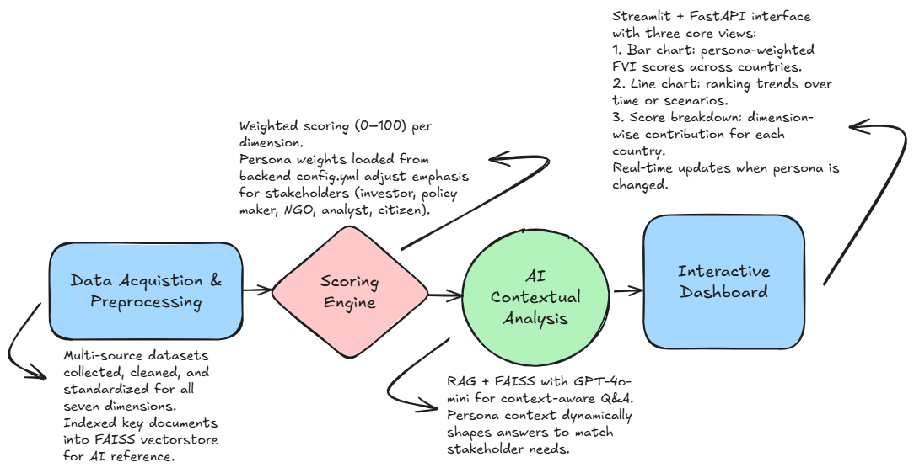
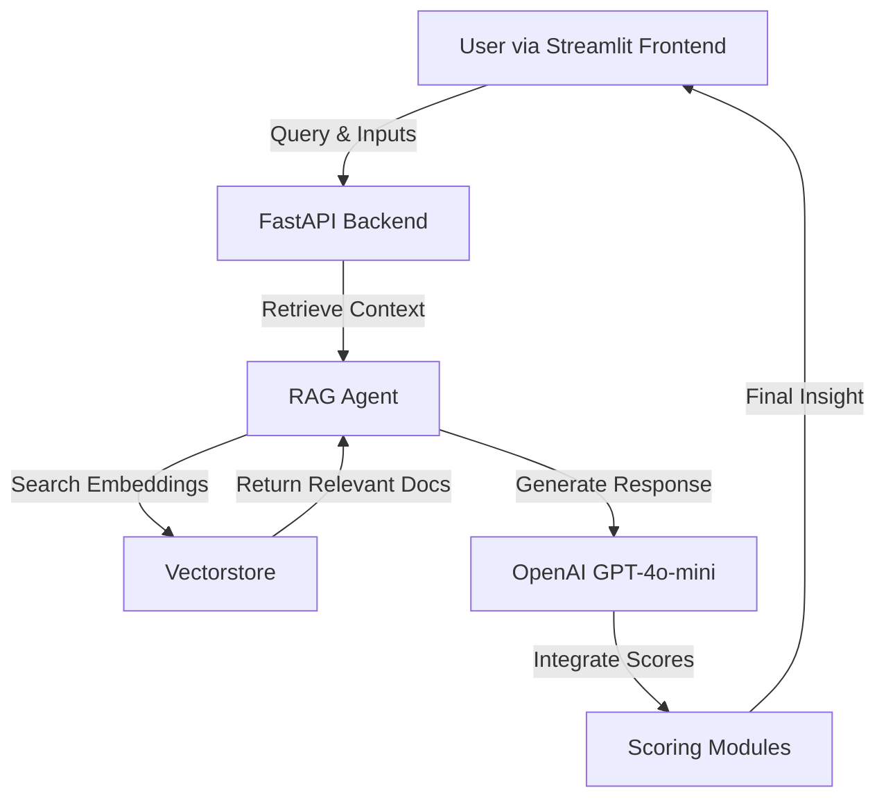

# Future Viability Index (FVI) – RAG-Enhanced Coal Industry Assessment

> **Version:** FVI_V1 – with Retrieval-Augmented Generation (RAG) Agent, OpenAI GPT-4o-mini integration, and updated project structure.

## 🚀 Tech Stack
- 🐍 [Python](https://www.python.org/)
- 📊 [Pandas](https://pandas.pydata.org/)
- 📈 [Matplotlib](https://matplotlib.org/) & [Plotly](https://plotly.com/python/)
- 🤖 [OpenAI GPT-4o-mini](https://platform.openai.com/docs/)
- 🔍 [FAISS](https://faiss.ai/)
- 🌐 [Streamlit](https://streamlit.io/)
- ⚡ [FastAPI](https://fastapi.tiangolo.com/)
- 📦 [PyYAML](https://pyyaml.org/)

---

## 📑 Table of Contents
1. [Project Overview](#project-overview)
2. [Motivation](#motivation)
3. [Features](#features)
4. [Methodology](#methodology)
5. [Project Flow](#project-flow)
6. [Architecture of FVI Intelligence Agent](#architecture-of-fvi-intelligence-agent)
7. [Directory Structure](#directory-structure)
8. [Installation & Setup](#installation--setup)
9. [Usage](#usage)
10. [Development Notes](#development-notes)
11. [Demonstration](#demonstration)
12. [Acknowledgement](#acknowledgement)  
13. [Authors](#authors)  
14. [Disclaimer](#disclaimer)  
15. [Data Transparency & EU AI Act Alignment](#data-transparency--eu-ai-act-alignment)  
16. [License](#license)  

---

## Project Overview
The **Future Viability Index (FVI)** is an AI-powered decision-support system designed to assess the long-term viability of the coal industry across seven critical dimensions: **infrastructure, necessity, resources, artificial support, ecological impact, economic factors, and emissions**.  
Developed during an internship with **Darwin & Goliath Ltd.**, the system integrates diverse global and national datasets with a **Retrieval-Augmented Generation (RAG)** framework to deliver contextual, persona-specific insights for **investors, policymakers, NGOs, analysts, and citizens**.

The platform provides **real-time viability scoring, cross-country comparisons, and investment recommendations** via an interactive dashboard and an AI-driven Q&A interface. By combining **quantitative scoring models** with **contextual industry intelligence**, the FVI offers a **transparent, scalable, and adaptable framework** to evaluate coal industry stability and support sustainable transition strategies within the global energy sector.

---

## Motivation
- The coal industry is under increasing **economic, environmental, and policy pressures** as nations transition toward cleaner energy sources.  
- Fragmented, outdated, or biased datasets make it challenging to accurately assess the long-term viability of coal operations.  
- Stakeholders — including **investors, policymakers, and NGOs** — require clear, multi-dimensional insights that balance **financial returns with social and environmental priorities**.  
- Existing tools often focus on **single factors** (e.g., emissions, reserves) and lack an **integrated, holistic scoring framework**.  

✅ The **Future Viability Index (FVI)** addresses this gap by combining **AI-powered contextual analysis** with **quantitative scoring models**, delivering **transparent, data-driven, and actionable evaluations**.

---

## Features
- **Modular Scoring** – Dedicated Python modules for each sustainability dimension.
- **RAG Agent** – Retrieves relevant knowledge from `fvi_knowledge.txt` in `vectorstore/` before responding.
- **Semantic Search** – Powered by ChromaDB or FAISS for efficient contextual retrieval.
- **Streamlit Frontend** – User-friendly interactive dashboard.
- **FastAPI Backend** – Handles chat queries, scoring, and data processing.
- **Configurable Knowledge Base** – Easy updates to domain-specific content.
- **Persona-Based Insights** – Responses tailored for investors, policymakers, and researchers.

---

## Methodology
The **Future Viability Index (FVI)** assesses coal industry stability across seven dimensions: **infrastructure, necessity, resources, artificial support, ecological, economic, and emissions**.  
It integrates multi-source datasets into a **weighted scoring engine** with persona-based adjustments for **investors, policymakers, NGOs, and citizens**.  

A **Retrieval-Augmented Generation (RAG)** pipeline with **FAISS** enables context-aware insights from curated industry knowledge.  
The system is deployed via a **Streamlit frontend** and **FastAPI backend**, providing **real-time scoring, cross-country comparisons, and stakeholder-specific recommendations** through an interactive dashboard.

---

## Project Flow


---

## Architecture of FVI Intelligence Agent

### Mermaid Diagram


---

## Directory Structure
```
FVI/
│── backend/                 # FastAPI backend & RAG agent
│── docs/                    # Documentation and diagrams
│── frontend/                # Streamlit UI, scoring modules & assets
│   │── assets/              # Static assets (logo, images)
│   │── data/                # Raw and processed datasets
│   │── scores/              # Modular scoring scripts
│── scripts/                 # Helper scripts (vectorstore building, utilities)
│── vectorstore/             # Knowledge embeddings & index
│── .env.template            # Environment variable template
│── config.yaml              # Main configuration
│── requirements.txt         # Python dependencies
│── README.md                # Project documentation
```

---

## Installation & Setup

### 1️⃣ Clone Repository
```bash
git clone <your-repo-url>
cd FVI
```

### 2️⃣ Create Virtual Environment
```bash
python -m venv .venv
source .venv/bin/activate     # Mac/Linux
.venv\Scripts\activate      # Windows (PowerShell)
```

### 3️⃣ Install Dependencies
```bash
pip install -r requirements.txt
```

### 4️⃣ Configure Environment
Copy `.env.template` to `.env` and fill in:
```ini
OPENAI_API_KEY=your_openai_api_key
```

### 5️⃣ Build Vectorstore
```bash
python scripts/build_vectorstore.py
```

---

## Usage

### Run Backend (Terminal:1)
```bash
python backend/main.py --port 8089
```

**Health Check**
```bash
curl http://localhost:8089/healthz
```

**Test Chat API**
```bash
curl -X POST "http://localhost:8089/api/chat" -H "Content-Type: application/json" -d '{"message":"Coal outlook for India in the next 5 years","persona":"investor"}'
```

### Run Frontend (Terminal:2)
```bash
cd frontend
streamlit run main.py --server.port 8502
```

---

## Development Notes
- Rebuild vectorstore after updating `fvi_knowledge.txt`.
- Keep `.venv` and `.env` out of Git (`.gitignore` is pre-configured).
- Use the `FVI_V2` branch for RAG-integrated development.

---

## Demonstration
📺 **Watch the demo here:** [YouTube Video](https://youtu.be/7mNofwNqJvU)

---

## Acknowledgement
We acknowledge the equal contributions of all team members in the design, development, and delivery of the Future Viability Index system.  
We extend our gratitude to **Darwin & Goliath Ltd.** for their guidance, domain expertise, and provision of data resources, which were instrumental in the successful completion of this project.

---

## Authors
| Name | Student ID | Email |
|------|------------|-------|
| Rahul Babu | 24203075 | rahul.babu@ucdconnect.ie |
| Ujwal Mojidra | 24214941 | ujwal.mojidra@ucdconnect.ie |
| Anshu Kumar | 24203717 | anshu.kumar@ucdconnect.ie |
| Rudra Nirmal Rawat | 24205441 | rudra.rawat@ucdconnect.ie |
| Sharvari Khatavkar | 24203968 | sharvari.khatavkar@ucdconnect.ie |

---
## Collaboration & Networking

We are open to collaboration, feedback, and knowledge exchange.  
If you find our project interesting or have ideas to improve it, feel free to connect with us or contribute to the repository.

**GitHub Profiles:**
- [Ujwal Mojidra](https://github.com/ujwal373)  
- [Rahul Babu](https://github.com/RahulB117)
- [Anshu Kumar](https://github.com/RahulB117)
- [Rudra Rawat](https://github.com/RahulB117)

**LinkedIn Profiles:**
- [Ujwal Mojidra](https://www.linkedin.com/in/ujwalmojidra/)  
- [Rahul Babu](https://www.linkedin.com/in/rahul-babu117/)
- [Anshu Kumar](https://www.linkedin.com/in/anshu-kumar-3592b31a9/)
- [Rudra Rawat](https://www.linkedin.com/in/rudra-rawat/)
- [Sharvari Khatavkar](https://www.linkedin.com/in/sharvari-khatavkar-520b131b6/)

---

## Disclaimer  

>  **Purpose Statement**  
> *The Future Viability Index (FVI) is an educational and research tool intended to provide systemic analysis of industries. It is not designed to predict short-term market movements or investment returns.*  
>
>  **No Investment Advice**  
> *FVI does not provide investment advice, recommendations, or endorsements of any financial instruments, securities, or investment strategies.*  
>
>  **Data Source & Limitations**  
> *FVI scores are based on publicly available and third-party data believed to be reliable, but FVI does not guarantee completeness or accuracy. Past performance, market conditions, and viability scores are not indicative of future outcomes.*  
>
>  **User Responsibility**  
> *Users are solely responsible for their own investment decisions. FVI and its affiliates accept no liability for any loss arising from reliance on its outputs.*  
>
>  **Jurisdictional Notes**  
> *Certain jurisdictions regulate the provision of financial advice. FVI is not licensed as a financial adviser in any jurisdiction.*  

---

## Data Transparency & EU AI Act Alignment  

>  In line with the **EU AI Act** principles of *transparency, reliability, and accountability*, we provide an overview of the datasets powering **FVI scores**.  

|  **Dimension**         |  **Primary Data Sources**                          |  **Limitations / Notes** |
|--------------------------|------------------------------------------------------|-----------------------------|
| 🏗️ **Infrastructure**     | World Bank, IEA, national statistics                 | May lack local project-level updates |
| 🛠️ **Necessity**          | UN SDG indicators, national consumption datasets     | Proxy measures; may vary regionally |
| ⛏️ **Resources**          | BP Statistical Review, USGS, IEA                     | Reserve estimates subject to revision |
| 💰 **Artificial Support** | IEA policy tracker, subsidy databases                | Some policies not updated in real-time |
| 🌱 **Ecological Impact**  | UNEP, IPCC, national emissions registries            | Country self-reported data may vary |
| 📉 **Economic Factors**   | IMF, World Bank, OECD, national accounts             | Time lags in reporting |
| 🌫️ **Emissions**         | IEA, UNFCCC, EPA, national GHG inventories           | Methodological differences across countries |

>  *All datasets are used for **educational, analytical, and non-commercial purposes only.***  

---

## License
© 2025 Darwin & Goliath Ltd. All rights reserved.  
This work was developed as part of an academic–industry collaboration with the MSc Data and Computational Science programme, University College Dublin.  
Any reproduction, distribution, or use of the material without prior written permission is prohibited.

---


